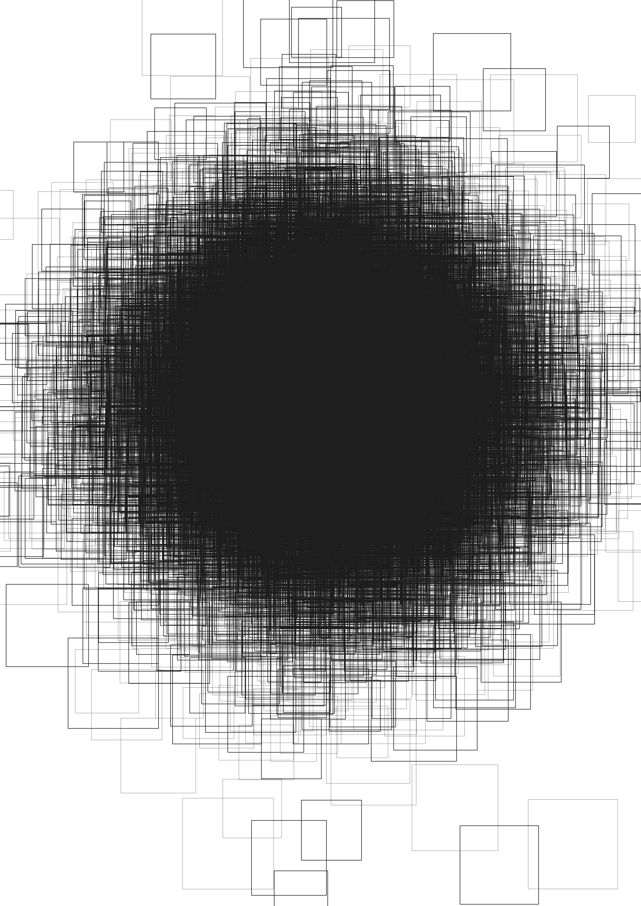

<h1 align="center"> 
Data Driven Artwork
</h1>

I make images, sound and maps using data.My aim is to upload my work here, alongside the code that is used to generate it and the methods used. I experiment with a number of formats and mediums so th outcome can be quite diverse. Here's some stuff I made:

- a couple of posters made from astronomical image datasets

 
<em style="font-size: 12px;"> <b>left</b>: Digital collage using Python and FIJI. Images from the 67p/churyumov-gerasimenko comet taken by the Roseta space mission. Masks from biological data, 3d surface plot of the image in the center of the poster, magenta LUT. </em>
<em style="font-size: 12px;"> <b>right</b>: Digital collage in black and white using Python, astronomical and satellite images mined from the Roseta mission website and Internet archive</em>

 
<em style="font-size: 12px;"> <b>left</b>: Colour poster made from video using Python and OpenCV</em>
<em style="font-size: 12px;"> <b>right</b>: There are no circles in this image. Von Mises circular distribution visualization with Python and OpenCV</em>

<iframe title="vimeo-player" src="https://player.vimeo.com/video/803008038?h=1dcdf76895" width="640" height="360" frameborder="0" allowfullscreen></iframe>

<iframe title="vimeo-player" src="https://player.vimeo.com/video/803001043?h=8c72fc71ed" width="640" height="360" frameborder="0"    allowfullscreen></iframe>
